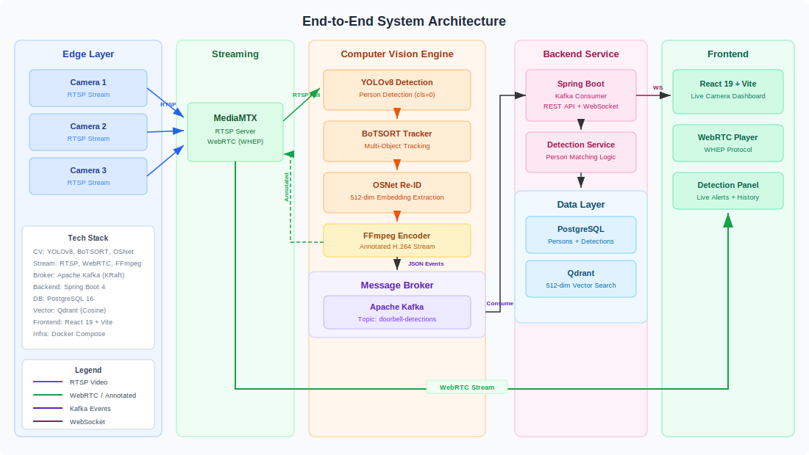

# Door-bell

Real-time multi-camera surveillance with person re-identification. YOLOv8 + BoTSORT + OSNet on the edge; Kafka, Qdrant, and WebSocket alerts on the backend.



## Architecture

| Component | Path | Role |
|---|---|---|
| Python Edge | `Python-edge/` | Captures webcam frames, pushes RTSP to MediaMTX via FFmpeg |
| MediaMTX | docker | RTSP/WebRTC media server |
| YOLO Worker | `Door-bell-backend/Python-engine/` | YOLOv8 detection, BoTSORT tracking, OSNet ReID, publishes events to Kafka |
| Java Backend | `Door-bell-backend/Java-backend/` | Spring Boot — consumes Kafka, matches embeddings, pushes WebSocket alerts |
| PostgreSQL | docker | Person and detection records |
| Qdrant | docker | 512-dim ReID embeddings (cosine) |
| Kafka | docker | Detection event bus (KRaft mode) |

**Stack:** Java 17 · Spring Boot 3 · Python 3.11 · YOLOv8 · OSNet · Kafka · PostgreSQL 16 · Qdrant · Docker Compose

## Quick Start

```bash
docker compose up --build -d
```

Frontend: <http://localhost>

Multi-camera mode (`cam-01`, `cam-02`, `cam-03`):

```bash
docker compose --profile multi-cam up --build -d
```

## Usage

```bash
docker compose down                              # stop
docker compose up --build -d <service>           # rebuild one service
docker compose logs -f <service>                 # follow logs
```

## GPU Deployment (AWS g4dn.xlarge)

```bash
cp .env.gpu .env   # set AWS_PUBLIC_HOST and WEBRTC_ICE_HOST
docker compose -f docker-compose.yml -f docker-compose.gpu.yml up --build -d
```

<details>
<summary>One-time EC2 setup</summary>

Install Docker:

```bash
curl -fsSL https://get.docker.com | sh
sudo usermod -aG docker ubuntu && newgrp docker
```

Install NVIDIA Container Toolkit:

```bash
curl -fsSL https://nvidia.github.io/libnvidia-container/gpgkey \
  | sudo gpg --dearmor -o /usr/share/keyrings/nvidia-container-toolkit-keyring.gpg
curl -s -L https://nvidia.github.io/libnvidia-container/stable/deb/nvidia-container-toolkit.list \
  | sed 's#deb https://#deb [signed-by=/usr/share/keyrings/nvidia-container-toolkit-keyring.gpg] https://#g' \
  | sudo tee /etc/apt/sources.list.d/nvidia-container-toolkit.list
sudo apt-get update && sudo apt-get install -y nvidia-container-toolkit
sudo nvidia-ctk runtime configure --runtime=docker
sudo systemctl restart docker
```

Verify:

```bash
docker run --rm --gpus all nvidia/cuda:12.1.0-base-ubuntu22.04 nvidia-smi
```

</details>
