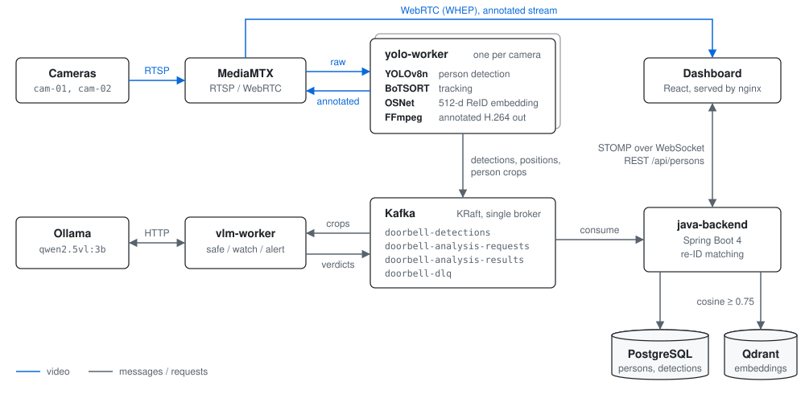

# Door-bell

Door-bell watches a doorway through one or more cameras and keeps track of who comes by. It detects and tracks people in each stream and uses appearance re-identification to give each person the same ID every time they show up, on any camera. It also asks a small vision-language model whether anything about them looks off. The browser dashboard shows the annotated video next to a live list of who's in frame, with an activity timeline underneath.

<!-- TODO: dashboard screenshot or GIF -->



## How it works

Each camera publishes an RTSP stream to [MediaMTX](https://github.com/bluenviron/mediamtx). A `yolo-worker` (one per camera) pulls the stream, runs YOLOv8n for person detection and BoTSORT for tracking, and draws the boxes. The annotated frames are re-encoded with FFmpeg and pushed back to MediaMTX as `cam-0N/annotated`, and the dashboard plays that over WebRTC.

When a new track appears, the worker crops that person from their first 5 usable frames, runs each crop through OSNet, and averages the results into a single 512-d embedding. The embedding is published to `doorbell-detections` together with per-frame box positions and a `left` event when the track is lost.

The Java backend looks the embedding up in Qdrant. If the best match has cosine similarity ≥ 0.75, it's someone we've seen before and their `last_seen_at` is updated. Otherwise a new person is created in PostgreSQL and the vector is stored. Results go to the browser over STOMP/WebSocket. You can give anyone a nickname from the dashboard, and the nickname stays with that ID.

Separately, the worker sends a JPEG crop of each person to `doorbell-analysis-requests`, and sends a new one every 5 s while they stay in frame. `vlm-worker` passes the crop to Ollama (`qwen2.5vl:3b` by default) and asks for a one-line description and a threat level of `safe`, `watch`, or `alert`. A 3B model gets this wrong often enough that its answer is run through a few hard rules in `apply_threat_overrides`. A visible weapon is always `alert`, a hat or mask is at least `watch`, and a pen on its own can't trigger an `alert`.

If the backend can't parse a message, it goes straight to `doorbell-dlq` so one bad payload doesn't stall the consumer. Processing failures, such as Postgres being down, are retried 3 times at 2 s intervals before they're dead-lettered.

## Running locally

You'll need Docker with Compose v2. For the threat analysis you also need [Ollama](https://ollama.com) running on the host. Without it everything else still works, and the dashboard just shows a VLM error next to each person.

```bash
ollama pull qwen2.5vl:3b
```

On Linux, start Ollama with `OLLAMA_HOST=0.0.0.0` so the container can reach it.

Create a `.env`. The GPU template also works for local runs if you change a few values:

```bash
cp .env.gpu.example .env
```

In `.env`, set `AWS_PUBLIC_HOST=localhost`, `WEBRTC_ICE_HOST=127.0.0.1` and `DEVICE=cpu`, and choose a `POSTGRES_PASSWORD`.

Start everything:

```bash
docker compose up --build -d
```

The first build takes a while because it installs PyTorch and torchreid. The YOLO and OSNet weights are downloaded the first time they're needed.

### Publishing a camera

The workers read from `rtsp://mediamtx:8554/cam-01` and `cam-02`, so anything that can push RTSP to those paths will work. To use a Mac's built-in webcam:

```bash
ffmpeg -f avfoundation -framerate 30 -video_size 1280x720 -i "0" -c:v libx264 -preset ultrafast -tune zerolatency -pix_fmt yuv420p -f rtsp -rtsp_transport tcp rtsp://localhost:8554/cam-01
```

You can also loop a recorded clip as the second camera:

```bash
ffmpeg -re -stream_loop -1 -i doorway.mp4 -an -c:v libx264 -preset ultrafast -tune zerolatency -f rtsp -rtsp_transport tcp rtsp://localhost:8554/cam-02
```

Then go to <http://localhost>. The dashboard is behind nginx basic auth. The username and password are set in `Door-bell-frontend/Dockerfile`, so change them before you put this anywhere public.

### Day-to-day

```bash
docker compose logs -f yolo-worker-1        # fps, inference time, track IDs
docker compose logs -f java-backend         # MATCH / NEW person, per-stage latency
docker compose up --build -d java-backend   # rebuild a single service
docker compose down                         # stop (add -v to also wipe Postgres and Qdrant)
```

To make the system forget every face but keep the detection history:

```bash
curl -X DELETE http://localhost:6333/collections/person-embeddings
docker compose restart java-backend         # recreates the collection on startup
```

### Adding a camera

1. In `docker-compose.yml`, copy the `yolo-worker-2` block as `yolo-worker-3` and change `CAMERA_ID`, `RTSP_INPUT` and `RTSP_OUTPUT` to `cam-03`. If you're on a GPU, add it to `docker-compose.gpu.yml` too.
2. Add `"cam-03"` to `CAMERAS` in `Door-bell-frontend/src/App.jsx`.
3. Publish the stream to `rtsp://<host>:8554/cam-03`.

## Configuration

These are the settings you're most likely to change. The defaults below are the ones in code. Note that `.env.gpu.example` overrides `CONFIDENCE` to `0.35`.

| Setting | Where | Default | What it does |
|---|---|---|---|
| `CONFIDENCE` | `.env` | `0.50` | YOLO detection threshold |
| `EMBEDDING_FRAMES` | `.env` | `5` | Frames averaged into one ReID embedding |
| `VLM_REANALYSIS_INTERVAL_SEC` | `.env` | `5.0` | How often a person still in frame is re-checked |
| `OUTPUT_FPS` | `.env` | `15` | Frame rate of the annotated stream |
| `OLLAMA_MODEL` | `.env` | `qwen2.5vl:3b` | Any Ollama vision model that can return JSON |
| `qdrant.similarity-threshold` | `application.properties` | `0.75` | Cosine score needed to count as the same person |

## GPU deployment (AWS g4dn.xlarge)

`docker-compose.gpu.yml` switches the YOLO workers to a CUDA base image and runs Ollama in a container on the same GPU.

```bash
cp .env.gpu.example .env    # set AWS_PUBLIC_HOST, WEBRTC_ICE_HOST, POSTGRES_PASSWORD
export COMPOSE_FILE=docker-compose.yml:docker-compose.gpu.yml
docker compose up --build -d
docker compose exec ollama ollama pull qwen2.5vl:3b
```

With `COMPOSE_FILE` exported, every `docker compose` command in this README picks up the GPU override. Without it, you have to pass both `-f` flags each time, or Compose won't know about the `ollama` service.

The security group needs inbound 80/tcp for the dashboard, 8554/tcp for cameras pushing RTSP, 8189/udp for WebRTC media, and 22 for SSH. Compose also publishes Postgres, Qdrant, Kafka and the backend's port 8080, and nothing outside the instance needs to reach them. Leave those ports closed unless you're connecting to one directly for debugging.

<details>
<summary>One-time EC2 setup (Docker + NVIDIA Container Toolkit)</summary>

```bash
curl -fsSL https://get.docker.com | sh
sudo usermod -aG docker ubuntu && newgrp docker
```

```bash
curl -fsSL https://nvidia.github.io/libnvidia-container/gpgkey \
  | sudo gpg --dearmor -o /usr/share/keyrings/nvidia-container-toolkit-keyring.gpg
curl -s -L https://nvidia.github.io/libnvidia-container/stable/deb/nvidia-container-toolkit.list \
  | sed 's#deb https://#deb [signed-by=/usr/share/keyrings/nvidia-container-toolkit-keyring.gpg] https://#g' \
  | sudo tee /etc/apt/sources.list.d/nvidia-container-toolkit.list
sudo apt-get update && sudo apt-get install -y nvidia-container-toolkit
sudo nvidia-ctk runtime configure --runtime=docker
sudo systemctl restart docker
```

Check that containers can see the GPU:

```bash
docker run --rm --gpus all nvidia/cuda:12.1.0-base-ubuntu22.04 nvidia-smi
```

</details>

## Tests

```bash
cd Door-bell-backend/Python-engine && pytest    # torch, YOLO and Kafka are stubbed; only needs numpy + opencv
cd Door-bell-backend/VLM-worker && pytest       # threat-level override rules
cd Door-bell-backend/Java-backend && ./mvnw test
```

`DoorBellBackendApplicationTests` starts the full Spring context, so it needs Postgres, Kafka and Qdrant running. To run only the unit tests, use `./mvnw test -Dtest='DetectionServiceTest,PersonControllerTest'`.

## Repository layout

```
Door-bell-backend/
  Python-engine/     yolo-worker: detection, tracking, ReID (kafka_worker.py, reid_extractor.py)
  VLM-worker/        Ollama client and threat-level rules (worker.py)
  Java-backend/      Spring Boot: Kafka consumers, Qdrant + Postgres, WebSocket, REST
Door-bell-frontend/  React dashboard and the nginx config that proxies /ws, /api and WHEP
docker-compose.yml        full stack, CPU
docker-compose.gpu.yml    GPU override, adds an Ollama container
```

## Known limitations

- ReID only runs on crops that are at least 80×200 px. Someone who never gets close to the camera gets a new ID on every visit.
- Matching is one nearest-neighbour lookup against a fixed threshold, and the stored embedding is never updated after the first sighting. People in similar clothes can get merged, and a big lighting change can split one person into two.
- The threat rules are deliberately jumpy. An umbrella counts as a weapon on purpose. This is a demo, not a security product.
- The camera list is hard-coded in two places, `docker-compose.yml` and `App.jsx`.
- Kafka runs as a single broker with replication factor 1.

## Authors

Claire Liu, Yu-Jing Wei
